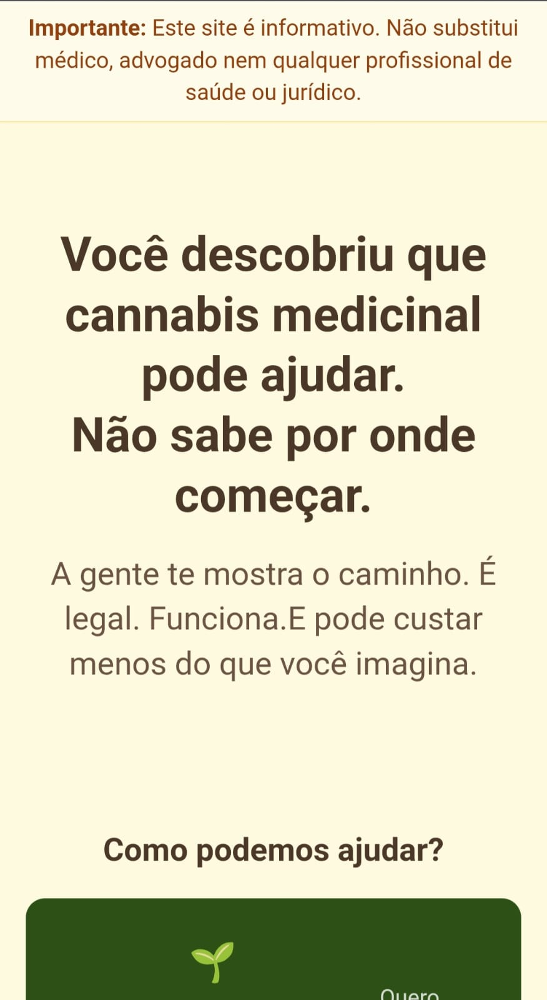
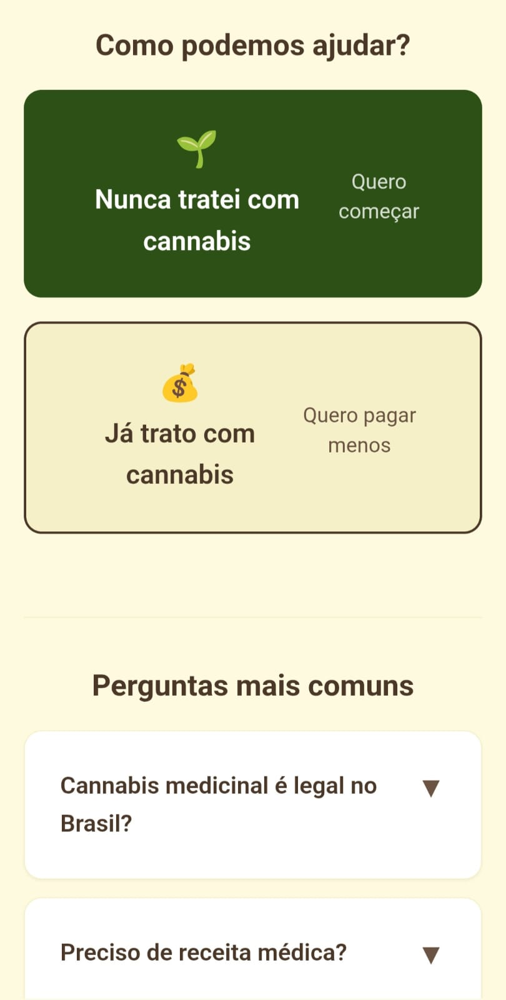
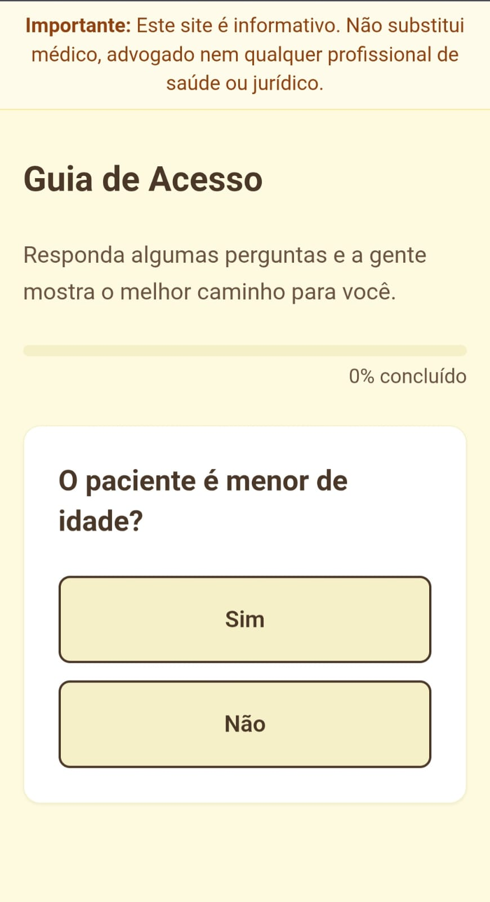
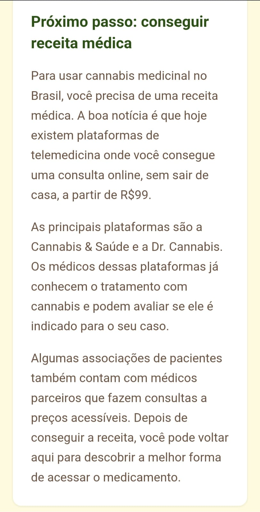
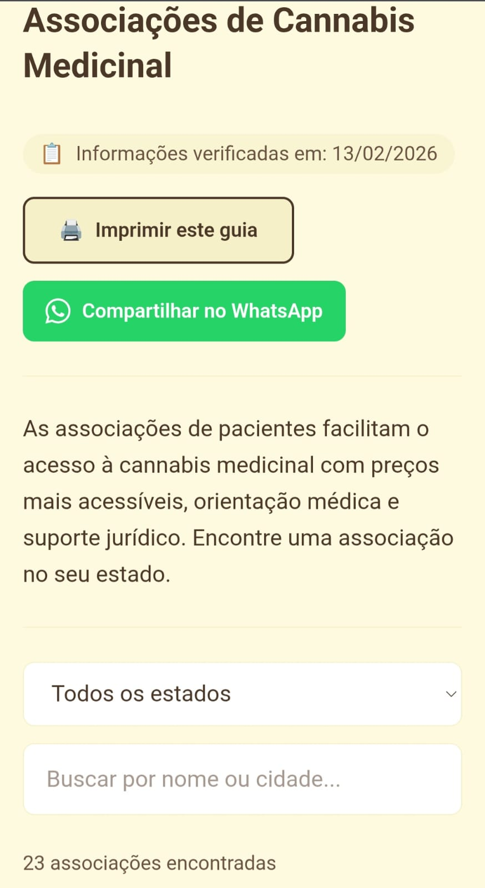

# Flor de Lei

[](https://flordelei.vercel.app)
[](LICENSE)


Guia gratuito e open-source para acesso à cannabis medicinal no Brasil.

**[flordelei.vercel.app](https://flordelei.vercel.app)**

## Missão

Ajudar pacientes e famílias a navegar o processo burocrático de acesso à cannabis medicinal — do zero ao tratamento, em linguagem simples, sem vender nada.

**Um desconhecido consegue sair do zero até o próximo passo concreto em 3 minutos.**

## Screenshots

<p align="center">
  
  
  
</p>
<p align="center">
  
  
  
</p>

## O que é

- **Wizard de Acesso** — responde "por onde começar?" em 5 cliques
- **Guia SUS** — checklist para conseguir tratamento gratuito
- **Guia Importação** — passo-a-passo ANVISA humanizado
- **Diretório de Associações** — por estado, com preço e contato
- **Guia de Uso Seguro** — como usar o medicamento corretamente

## Princípios

- 100% gratuito, sem fins lucrativos
- Zero coleta de dados, zero cookies
- Código aberto (MIT)
- Informativo — não substitui médico nem advogado
- Mobile-first, acessível, imprimível
- Toda informação tem fonte pública verificável

## Stack

| Camada | Tecnologia | Custo |
|---|---|---|
| Framework | Next.js 14 (SSG) | Grátis |
| Styling | Tailwind CSS | Grátis |
| Linguagem | TypeScript | Grátis |
| Hosting | Vercel free tier | Grátis |
| Validação | JSON Schema + ajv (CI) | Grátis |

## Como contribuir

### Dados de associações

O diretório depende da comunidade. Se você conhece uma associação que não está listada ou cujos dados estão desatualizados:

1. Abra uma [Issue](../../issues) com os dados
2. Ou envie um Pull Request editando `/data/associacoes.json`
3. Ou preencha nosso [formulário](https://docs.google.com/forms/d/e/1FAIpQLSdtYZHV0zetR5FNn4ADjWLLV-XNNArvaU9kC5KNczcym0h7RA/viewform)

Toda contribuição de dados é validada automaticamente pelo CI contra o JSON Schema (`/data/associacoes.schema.json`).

### Código

1. Fork o repositório
2. Crie uma branch (`git checkout -b minha-contribuicao`)
3. Commit suas mudanças
4. Abra um Pull Request

### Reportar problema

- Informação desatualizada? Abra uma [Issue](../../issues)
- Link quebrado? Abra uma [Issue](../../issues)

> Links quebrados são verificados automaticamente toda semana. Se você encontrar um link com problema antes disso, abra uma Issue.

## Desenvolvimento local

```bash
npm install
npm run validate-data  # valida JSONs contra schema
npm run check-links    # verifica links externos
npm run dev            # http://localhost:3000
npm run build          # build SSG completo
```

## Processo de manutenção dos dados

- Dados revisados trimestralmente (mínimo)
- Qualquer pessoa pode reportar dados desatualizados via formulário ou Issue
- Cada associação tem campo `dataVerificacao` — associações sem verificação há 6+ meses recebem alerta visual
- PRs que modifiquem `/data/**` passam por validação automática no CI

## Estrutura do projeto

```
/app
  /page.tsx                → Landing
  /guia/page.tsx           → Wizard de Acesso
  /sus/page.tsx            → Guia SUS
  /importacao/page.tsx     → Guia Importação ANVISA
  /associacoes/page.tsx    → Diretório de Associações
  /uso-seguro/page.tsx     → Guia de Uso Seguro
/data
  /associacoes.json        → Dados de associações
  /associacoes.schema.json → JSON Schema de validação
  /wizard-tree.json        → Árvore de decisão do wizard
/components                → Componentes React
/lib                       → Types, constants, engine
/scripts                   → Validação de dados
```

## Licença

MIT — use, copie, distribua, modifique livremente.

## Disclaimer

Este site é uma ferramenta educativa e informativa. Não substitui consulta médica nem orientação jurídica. Não prescrevemos, vendemos ou intermediamos produtos. Consulte um profissional de saúde antes de iniciar qualquer tratamento.

---

Feito para quem precisa.
